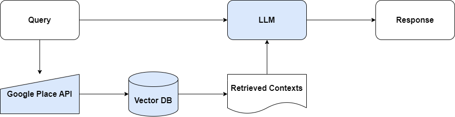
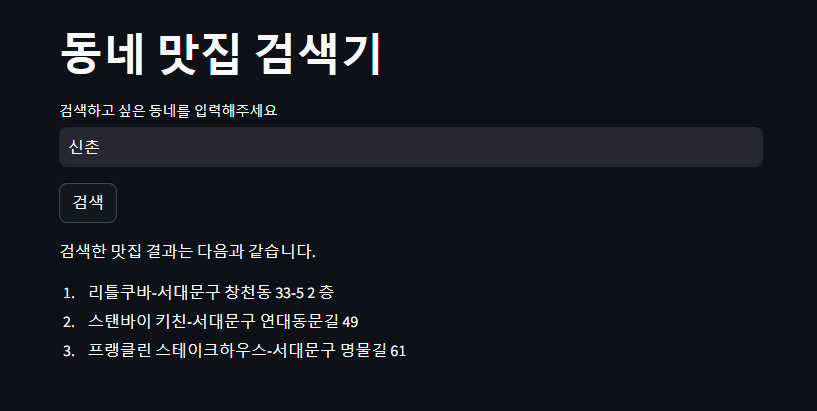

# 동네 맛집 검색기

GPT-4, Google Place API를 사용한 RAG 기반 동네 근처 맛집 검색기입니다.

검색한 지역에서 500m 이내 식당을 검색해 평점 상위 3개를 알려줍니다.

RAG에 사용한 Vector store는 FAISS를 사용했습니다.

Google Place API를 사용해 식당 정보를 받아와 Vector DB에 저장하고, Vector DB 정보와 쿼리를 기반으로 LLM 모델에서 결과를 얻는 구조입니다.

 
     

 
     

